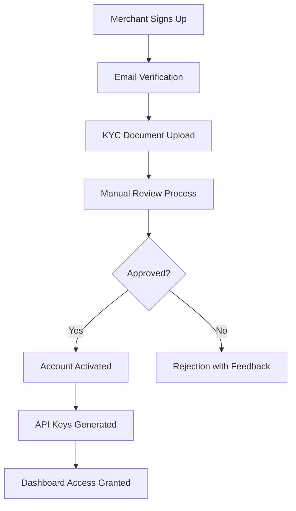
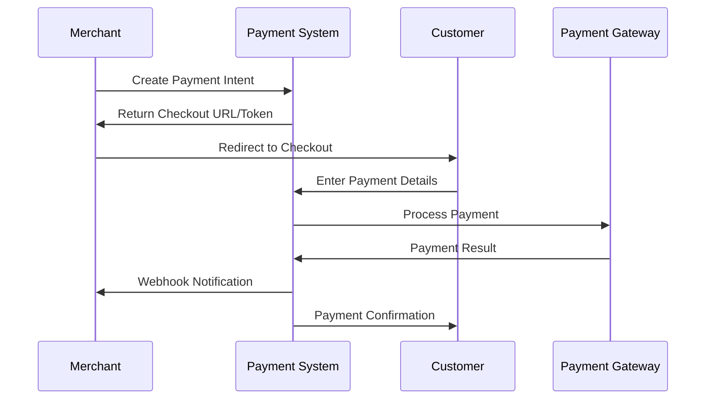
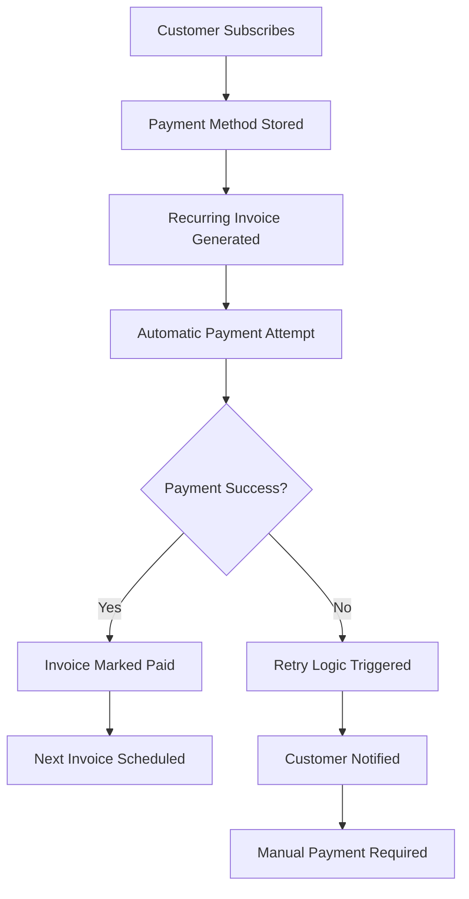

# Payment System MVP - Tentative Plan

## Table of Contents
1. [Key Objectives](#key-objectives)
2. [System Architecture Overview](#system-architecture-overview)
3. [Core Features & Requirements](#core-features--requirements)
4. [User Workflows](#user-workflows)
5. [Microservices Architecture](#microservices-architecture)
6. [Data Models & Schema](#data-models--schema)

---

## Key Objectives
- Enable seamless merchant onboarding with KYC verification
- Provide secure payment processing with tokenization
- Support both one-time and subscription billing models
- Ensure robust webhook and notification systems
- Maintain PCI-DSS compliance and audit trails

---

## System Architecture Overview

The payment system follows a **microservices architecture** with clear service boundaries, event-driven communication, and strict data ownership principles.

### Architecture Principles
- **Service Autonomy**: Each service owns its data and business logic
- **API-First Communication**: Services communicate via REST APIs and async events
- **Event-Driven Design**: Critical business events trigger downstream actions
- **Security by Design**: Authentication, authorization, and encryption at every layer
- **Compliance Ready**: Built-in audit trails and regulatory compliance features

### High-Level Components
```
┌─────────────────┐    ┌─────────────────┐    ┌─────────────────┐
│   Merchant      │    │    Customer     │    │   Admin Panel   │
│   Dashboard     │    │   Checkout UI   │    │                 │
└─────────────────┘    └─────────────────┘    └─────────────────┘
         │                       │                       │
         └───────────────────────┼───────────────────────┘
                                 │
         ┌───────────────────────────────────────────────┐
         │              API Gateway                      │
         │        (Auth, Rate Limiting, Routing)        │
         └───────────────────────────────────────────────┘
                                 │
    ┌────────────────────────────┼────────────────────────────┐
    │                            │                            │
┌───▼───┐  ┌────────┐  ┌────────▼──┐  ┌─────────┐  ┌────────┐
│ User  │  │Customer│  │  Payment  │  │ Invoice │  │Webhook │
│Service│  │Service │  │  Service  │  │ Service │  │Service │
└───────┘  └────────┘  └───────────┘  └─────────┘  └────────┘
    │          │             │             │           │
┌───▼───┐  ┌────▼───┐  ┌─────▼─────┐  ┌───▼────┐  ┌──▼─────┐
│ Auth  │  │Product │  │Payment    │  │Ledger  │  │Notify  │
│Service│  │Service │  │Method Svc │  │Service │  │Service │
└───────┘  └────────┘  └───────────┘  └────────┘  └────────┘
```

---

## Core Features & Requirements

### Phase 1: Essential MVP Features

#### A. Merchant Management

1. **Merchant Registration & KYC**
   - User signup with email verification
   - KYC document upload (PAN, GST, Bank Details)
   - Manual verification workflow
   - Account approval/rejection

2. **API Key Management**
   - Test and Live mode environments
   - Secure API key generation and rotation
   - Scoped permissions per key

3. **Merchant Dashboard**
   - Transaction overview and analytics
   - Customer management interface
   - Plan and product configuration
   - Payout history and settings

#### B. Product & Billing Management
4. **Product & Plan Management**
   - Create one-time products
   - Define subscription plans (monthly/yearly)
   - Pricing configuration with currency support
   - Product metadata and descriptions

5. **Customer Management**
   - Customer profile creation and updates
   - Payment method storage and management
   - Transaction history per customer
   - Custom metadata support

6. **Invoice Generation**
   - Automated invoice creation based on plans
   - Manual invoice generation
   - Invoice status tracking (draft, sent, paid, overdue)
   - PDF generation and email delivery

#### C. Payment Processing
7. **Payment Session Management**
   - Secure payment intent creation
   - Hosted checkout page generation
   - Embeddable payment forms
   - Session expiry and security controls

8. **Payment Processing & Tokenization**
   - Secure card tokenization
   - Multiple payment method support (cards, UPI, wallets)
   - Payment confirmation and capture
   - 3D Secure authentication support

9. **Customer Payment Interface**
   - Responsive hosted checkout pages
   - Embeddable payment widgets
   - Mobile-optimized payment flows
   - Payment method selection and storage

10. **Refund Management**
    - Full and partial refund processing
    - Refund reason tracking
    - Automated refund notifications
    - Merchant refund dashboard

#### D. Integration & Communication
11. **Webhook System**
    - Event-driven webhook delivery
    - HMAC signature verification
    - Retry logic with exponential backoff
    - Webhook endpoint management

12. **Notification System**
    - Email notifications (receipts, failures, invoices)
    - SMS notifications for critical events
    - Push notifications for mobile apps
    - Template-based messaging

#### E. Security & Operations
13. **API Security**
    - Bearer token authentication
    - Rate limiting per merchant
    - Request/response logging
    - IP whitelisting support

14. **Idempotency & Reliability**
    - Idempotency key support for safe retries
    - Transaction deduplication
    - Graceful error handling
    - Circuit breaker patterns

15. **Audit & Monitoring**
    - Comprehensive audit logs
    - API request/response logging
    - Webhook delivery tracking
    - Performance monitoring and alerting

---

## User Workflows

### 1. Merchant Onboarding Journey

#### 1.1 Registration & Verification


#### 1.2 Development Integration
- Merchant receives test and live API keys
- Integrates using provided SDKs or REST APIs
- Tests payment flows in sandbox environment
- Switches to live mode after testing

### 2. Customer Payment Flow

#### 2.1 Standard Payment Process


#### 2.2 Subscription Billing


### 3. Post-Payment Processing

#### 3.1 Success Flow
1. Payment confirmed and captured
2. Invoice marked as paid
3. Ledger entries created (double-entry accounting)
4. Merchant webhook triggered
5. Customer receipt sent
6. Payout scheduled for merchant

#### 3.2 Failure Flow
1. Payment attempt fails
2. Failure reason logged
3. Customer and merchant notified
4. Retry logic initiated (if applicable)
5. Manual intervention required for resolution

---

## Microservices Architecture

### Service Catalog

### 0. API Gateway

**Purpose**: Unified entry point for all client and service requests

**Responsibilities**:
- Request routing and service discovery
- Forwarding auth headers, injecting user/org claims
- Rate limiting per IP/merchant
- Logging, tracing, and error formatting
- Header management, CORS, and API monitoring

**Key Entities**: Routing rules, Auth tokens, Rate limit counters, Correlation IDs


#### 1. User Service
**Purpose**: Platform user management and organizational structure

**Responsibilities**:
- User registration and profile management
- Organization/team management
- User role and permission assignment
- Account status and verification tracking

**Key Entities**: Users, Profiles, Organizations, KYC Documents

#### 2. Auth Service
**Purpose**: Authentication and authorization management

**Responsibilities**:
- API key generation and validation
- Session management
- OAuth token handling
- Rate limiting enforcement

**Key Entities**: API Keys, Sessions, OAuth Tokens, Rate Limits

#### 3. Customer Service
**Purpose**: End-customer management for merchants

**Responsibilities**:
- Customer profile creation and updates
- Customer metadata management
- Payment method association
- Customer communication preferences

**Key Entities**: Customers, Customer Metadata, Payment Methods

#### 4. Product Service
**Purpose**: Product catalog and pricing management

**Responsibilities**:
- Product definition and categorization
- Pricing model configuration
- Plan and subscription management
- Product metadata and descriptions

**Key Entities**: Products, Prices, Plans, Subscriptions

#### 5. Invoice Service
**Purpose**: Invoice generation and management

**Responsibilities**:
- Invoice creation and lifecycle management
- Invoice item calculation
- Due date tracking and overdue management
- Invoice PDF generation

**Key Entities**: Invoices, Invoice Items, Invoice History

#### 6. Payment Service
**Purpose**: Core payment processing orchestration

**Responsibilities**:
- Payment intent creation and management
- Payment method validation
- Transaction processing coordination
- Payment status tracking and updates

**Key Entities**: Payment Intents, Payment Attempts, Transactions

#### 7. Payment Method Service
**Purpose**: Secure payment method storage and tokenization

**Responsibilities**:
- Payment method tokenization
- Secure storage of sensitive data
- Payment method validation
- Token lifecycle management

**Key Entities**: Payment Methods, Tokens, Validation Results

#### 8. Payout Service
**Purpose**: Merchant settlement and payout management

**Responsibilities**:
- Payout calculation and scheduling
- Bank account management
- Payout processing and tracking
- Settlement reporting

**Key Entities**: Payouts, Bank Accounts, Settlement Reports

#### 9. Ledger Service
**Purpose**: Financial accounting and audit trail

**Responsibilities**:
- Double-entry bookkeeping
- Transaction recording and reconciliation
- Balance calculation and reporting
- Audit trail maintenance

**Key Entities**: Accounts, Transactions, Entries, Balances

#### 10. Webhook Service
**Purpose**: Event notification and delivery

**Responsibilities**:
- Webhook endpoint management
- Event queuing and delivery
- Retry logic and failure handling
- Delivery status tracking

**Key Entities**: Webhook Endpoints, Events, Delivery Attempts

#### 11. Notification Service
**Purpose**: Multi-channel communication management

**Responsibilities**:
- Email, SMS, and push notification delivery
- Template management and personalization
- Delivery tracking and analytics
- Communication preference management

**Key Entities**: Notifications, Templates, Delivery Logs

#### 12. Risk Service
**Purpose**: Fraud detection and risk management

**Responsibilities**:
- Transaction risk scoring
- Rule-based fraud detection
- Suspicious activity monitoring
- Risk event logging and analysis

**Key Entities**: Risk Events, Rules, Risk Scores, Investigations

---

## Data Models & Schema

### Core Database Schemas

#### User Service Schema
```sql
-- Core user management
CREATE TABLE users (
    id UUID PRIMARY KEY DEFAULT gen_random_uuid(),
    email VARCHAR(255) UNIQUE NOT NULL,
    password_hash VARCHAR(255) NOT NULL,
    status VARCHAR(50) DEFAULT 'pending_verification',
    email_verified_at TIMESTAMP,
    created_at TIMESTAMP DEFAULT CURRENT_TIMESTAMP,
    updated_at TIMESTAMP DEFAULT CURRENT_TIMESTAMP
);

CREATE TABLE user_profiles (
    id UUID PRIMARY KEY DEFAULT gen_random_uuid(),
    user_id UUID NOT NULL REFERENCES users(id),
    full_name VARCHAR(255) NOT NULL,
    phone VARCHAR(20),
    address JSONB,
    created_at TIMESTAMP DEFAULT CURRENT_TIMESTAMP,
    updated_at TIMESTAMP DEFAULT CURRENT_TIMESTAMP
);

CREATE TABLE organizations (
    id UUID PRIMARY KEY DEFAULT gen_random_uuid(),
    name VARCHAR(255) NOT NULL,
    owner_id UUID NOT NULL REFERENCES users(id),
    business_type VARCHAR(100),
    tax_id VARCHAR(100),
    status VARCHAR(50) DEFAULT 'active',
    metadata JSONB DEFAULT '{}',
    created_at TIMESTAMP DEFAULT CURRENT_TIMESTAMP,
    updated_at TIMESTAMP DEFAULT CURRENT_TIMESTAMP
);

CREATE TABLE kyc_documents (
    id UUID PRIMARY KEY DEFAULT gen_random_uuid(),
    user_id UUID NOT NULL REFERENCES users(id),
    document_type VARCHAR(50) NOT NULL, -- 'pan', 'gst', 'bank_statement'
    file_url VARCHAR(500) NOT NULL,
    verification_status VARCHAR(50) DEFAULT 'pending',
    verified_at TIMESTAMP,
    notes TEXT,
    created_at TIMESTAMP DEFAULT CURRENT_TIMESTAMP
);
```

#### Customer Service Schema
```sql
CREATE TABLE customers (
    id UUID PRIMARY KEY DEFAULT gen_random_uuid(),
    organization_id UUID NOT NULL REFERENCES organizations(id),
    external_id VARCHAR(255), -- Merchant's internal customer ID
    email VARCHAR(255) NOT NULL,
    name VARCHAR(255),
    phone VARCHAR(20),
    default_payment_method_id UUID,
    status VARCHAR(50) DEFAULT 'active',
    created_at TIMESTAMP DEFAULT CURRENT_TIMESTAMP,
    updated_at TIMESTAMP DEFAULT CURRENT_TIMESTAMP,
    UNIQUE(organization_id, external_id)
);

CREATE TABLE customer_metadata (
    id UUID PRIMARY KEY DEFAULT gen_random_uuid(),
    customer_id UUID NOT NULL REFERENCES customers(id),
    key VARCHAR(255) NOT NULL,
    value TEXT,
    created_at TIMESTAMP DEFAULT CURRENT_TIMESTAMP,
    UNIQUE(customer_id, key)
);
```

#### Product Service Schema
```sql
CREATE TABLE products (
    id UUID PRIMARY KEY DEFAULT gen_random_uuid(),
    organization_id UUID NOT NULL REFERENCES organizations(id),
    name VARCHAR(255) NOT NULL,
    description TEXT,
    type VARCHAR(50) NOT NULL, -- 'one_time', 'subscription'
    status VARCHAR(50) DEFAULT 'active',
    metadata JSONB DEFAULT '{}',
    created_at TIMESTAMP DEFAULT CURRENT_TIMESTAMP,
    updated_at TIMESTAMP DEFAULT CURRENT_TIMESTAMP
);

CREATE TABLE prices (
    id UUID PRIMARY KEY DEFAULT gen_random_uuid(),
    product_id UUID NOT NULL REFERENCES products(id),
    amount INTEGER NOT NULL, -- Amount in smallest currency unit
    currency VARCHAR(3) NOT NULL DEFAULT 'INR',
    billing_scheme VARCHAR(50) DEFAULT 'per_unit',
    interval VARCHAR(50), -- 'day', 'week', 'month', 'year' for subscriptions
    interval_count INTEGER DEFAULT 1,
    trial_period_days INTEGER DEFAULT 0,
    status VARCHAR(50) DEFAULT 'active',
    created_at TIMESTAMP DEFAULT CURRENT_TIMESTAMP
);
```

#### Payment Service Schema
```sql
CREATE TABLE payment_intents (
    id UUID PRIMARY KEY DEFAULT gen_random_uuid(),
    organization_id UUID NOT NULL REFERENCES organizations(id),
    customer_id UUID NOT NULL REFERENCES customers(id),
    amount INTEGER NOT NULL,
    currency VARCHAR(3) NOT NULL DEFAULT 'INR',
    status VARCHAR(50) DEFAULT 'requires_payment_method',
    payment_method_id UUID,
    invoice_id UUID,
    description TEXT,
    metadata JSONB DEFAULT '{}',
    created_at TIMESTAMP DEFAULT CURRENT_TIMESTAMP,
    updated_at TIMESTAMP DEFAULT CURRENT_TIMESTAMP
);

CREATE TABLE payment_attempts (
    id UUID PRIMARY KEY DEFAULT gen_random_uuid(),
    payment_intent_id UUID NOT NULL REFERENCES payment_intents(id),
    payment_method_id UUID NOT NULL,
    amount INTEGER NOT NULL,
    currency VARCHAR(3) NOT NULL,
    status VARCHAR(50) NOT NULL, -- 'processing', 'succeeded', 'failed'
    gateway_transaction_id VARCHAR(255),
    gateway_response JSONB,
    error_code VARCHAR(100),
    error_message TEXT,
    processed_at TIMESTAMP,
    created_at TIMESTAMP DEFAULT CURRENT_TIMESTAMP
);
```

#### Invoice Service Schema
```sql
CREATE TABLE invoices (
    id UUID PRIMARY KEY DEFAULT gen_random_uuid(),
    organization_id UUID NOT NULL REFERENCES organizations(id),
    customer_id UUID NOT NULL REFERENCES customers(id),
    invoice_number VARCHAR(100) UNIQUE NOT NULL,
    status VARCHAR(50) DEFAULT 'draft',
    subtotal INTEGER NOT NULL,
    tax_amount INTEGER DEFAULT 0,
    total_amount INTEGER NOT NULL,
    currency VARCHAR(3) NOT NULL DEFAULT 'INR',
    due_date DATE,
    paid_at TIMESTAMP,
    created_at TIMESTAMP DEFAULT CURRENT_TIMESTAMP,
    updated_at TIMESTAMP DEFAULT CURRENT_TIMESTAMP
);

CREATE TABLE invoice_items (
    id UUID PRIMARY KEY DEFAULT gen_random_uuid(),
    invoice_id UUID NOT NULL REFERENCES invoices(id),
    product_id UUID REFERENCES products(id),
    description TEXT NOT NULL,
    quantity INTEGER DEFAULT 1,
    unit_amount INTEGER NOT NULL,
    amount INTEGER NOT NULL,
    created_at TIMESTAMP DEFAULT CURRENT_TIMESTAMP
);
```

#### Ledger Service Schema
```sql
CREATE TABLE accounts (
    id UUID PRIMARY KEY DEFAULT gen_random_uuid(),
    owner_id UUID NOT NULL, -- Can reference users, organizations, or system
    account_type VARCHAR(50) NOT NULL, -- 'merchant_balance', 'system_balance', 'gateway_balance'
    currency VARCHAR(3) NOT NULL DEFAULT 'INR',
    balance INTEGER DEFAULT 0,
    status VARCHAR(50) DEFAULT 'active',
    created_at TIMESTAMP DEFAULT CURRENT_TIMESTAMP
);

CREATE TABLE transactions (
    id UUID PRIMARY KEY DEFAULT gen_random_uuid(),
    reference_type VARCHAR(50) NOT NULL, -- 'payment', 'refund', 'payout'
    reference_id UUID NOT NULL,
    description TEXT,
    amount INTEGER NOT NULL,
    currency VARCHAR(3) NOT NULL,
    created_at TIMESTAMP DEFAULT CURRENT_TIMESTAMP
);

CREATE TABLE ledger_entries (
    id UUID PRIMARY KEY DEFAULT gen_random_uuid(),
    transaction_id UUID NOT NULL REFERENCES transactions(id),
    account_id UUID NOT NULL REFERENCES accounts(id),
    entry_type VARCHAR(10) NOT NULL CHECK (entry_type IN ('debit', 'credit')),
    amount INTEGER NOT NULL,
    balance_after INTEGER NOT NULL,
    created_at TIMESTAMP DEFAULT CURRENT_TIMESTAMP
);
```
